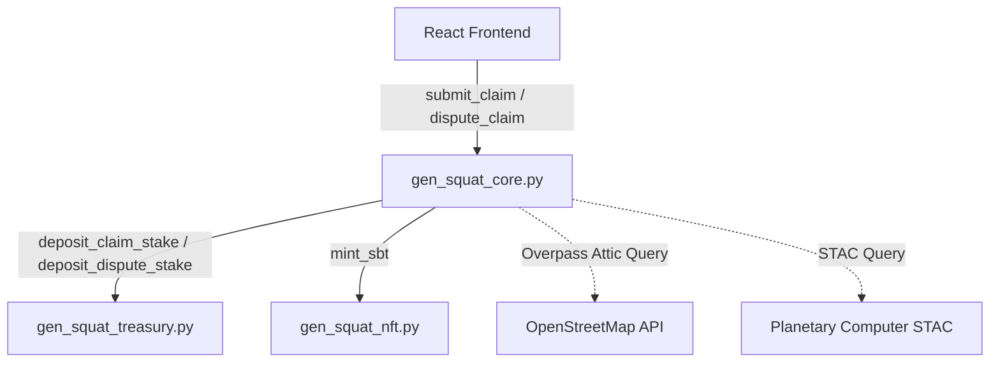
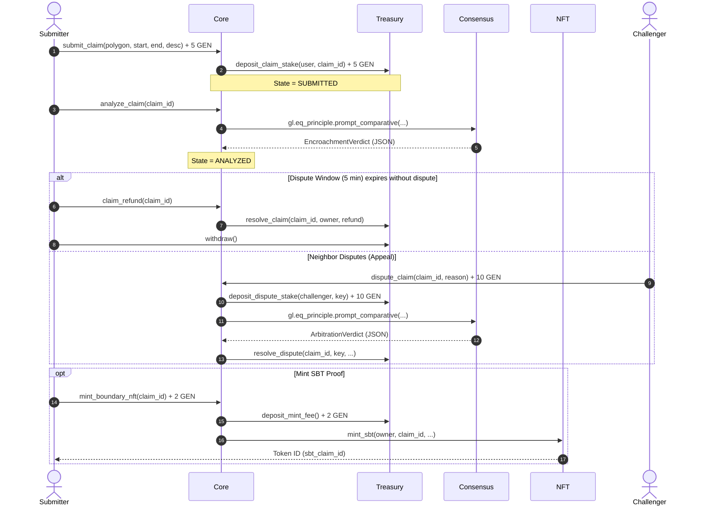

# Architectural Specifications

GenSquat v2 utilizes a three-tier smart contract system separating Core business logic, Treasury assets, and SBT (Soulbound Token) boundary credentials. This separation limits state bloat and protects funds using isolated memory spaces in GenLayer.

## Contract Modules

### 1. Core Contract (`gen_squat_core.py`)
Responsible for claim lifecycle states, data orchestration, and calling democratic consensus triggers.
- **Data Layer:** Utilizes two nondet-safe REST calls:
  - **OpenStreetMap Overpass API:** Queries boundary nodes with a date parameter (`[date:"YYYY-MM-DDT00:00:00Z"]`) to review historical fence/perimeter modifications.
  - **Microsoft Planetary Computer STAC API:** Fetches Sentinel-2 imagery catalog metadata matching the parcel's bounding box and date ranges.
- **Consensus:** Invokes `gl.eq_principle.prompt_comparative` for both initial analysis (`analyze_claim`) and arbitration appeals (`dispute_claim`). This prompts independent validator nodes to render the comparative satellite timeline and confirm encroachment layout matches.

### 2. Treasury Contract (`gen_squat_treasury.py`)
Responsible for locking/unlocking user stakes, tracking surplus pools, and distributing rewards.
- **Pull-Payment Pattern:** Users call `withdraw()` to pull their claims. This isolates treasury storage and prevents re-entrancy exploits.
- **Stake Tiers:**
  - Claim Submission Lock: `5.0 GEN`
  - Dispute Appeal Lock: `10.0 GEN`
  - SBT Minting Fee: `2.0 GEN`

### 3. Soulbound Token Contract (`gen_squat_nft.py`)
Manages unique non-transferable NFTs (Soulbound Tokens) certifying audited boundary coordinates.
- **Access Control:** Minting restricted exclusively to the Core contract address.
- **Verification Guarantee:** SBTs can only be minted if the initial analysis or subsequent dispute arbitration achieves a confidence score of $\ge 0.8$.

---

## State Lifecycle Sequence

